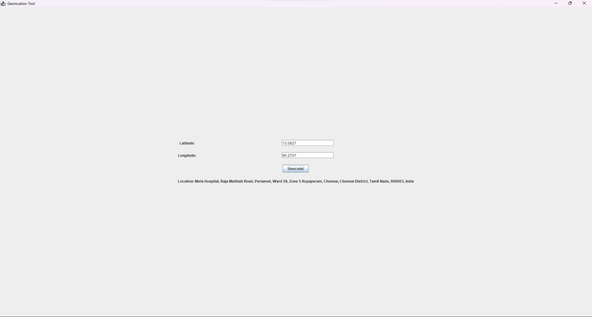

# GeolocationToolGUI

The GeolocationToolGUI is a Java application that allows you to retrieve the location information (address) based on latitude and longitude coordinates using the Nominatim API provided by OpenStreetMap. This tool provides a graphical user interface (GUI) for entering the latitude and longitude values and displays the corresponding location information.

## Project Description

The GeolocationToolGUI project utilizes the following components and libraries:

- Java Swing: The GUI framework used to create the graphical interface.
- Google Gson: A Java library for parsing JSON data.

The project follows a simple flow:

1. The user launches the application.
2. The GUI window titled "Geolocation Tool" appears.
3. The user enters the latitude and longitude values in the respective text fields.
4. After entering the values, the user clicks the "Geocode" button.
5. The application sends a request to the Nominatim API to retrieve the location information.
6. The API response is received and parsed.
7. The extracted location information (display name) is displayed in a label below the button.

## Code
 GeolocationTool.java
      
   import com.google.gson.JsonElement;
   import com.google.gson.JsonObject;
   import com.google.gson.JsonParser;
   
   import javax.swing.*;
   import java.awt.*;
   import java.awt.datatransfer.Clipboard;
   import java.awt.datatransfer.StringSelection;
   import java.awt.event.ActionEvent;
   import java.awt.event.ActionListener;
   import java.io.*;
   import java.net.HttpURLConnection;
   import java.net.URL;
   import java.util.ArrayList;
   import java.util.List;
   
   public class GeolocationToolGUI {
       private static final String NOMINATIM_API_URL = "https://nominatim.openstreetmap.org/reverse?format=jsonv2&lat=";
   
       private JFrame frame;
       private JLabel latitudeLabel;
       private JTextField latitudeTextField;
       private JLabel longitudeLabel;
       private JTextField longitudeTextField;
       private JButton geocodeButton;
       private JButton clearButton;
       private JButton copyButton;
       private JButton deleteButton;
       private JButton clearHistoryButton;
       private JButton saveHistoryButton;
       private JButton loadHistoryButton;
       private JLabel resultLabel;
       private JList<String> searchHistoryList;
       private DefaultListModel<String> searchHistoryModel;
       private List<SearchEntry> searchHistory;
       private static final int MAX_HISTORY_SIZE = 10;
       private static final String HISTORY_FILE_PATH = "search_history.txt";
   
       public static void main(String[] args) {
           SwingUtilities.invokeLater(new Runnable() {
               public void run() {
                   new GeolocationToolGUI().createAndShowGUI();
               }
           });
       }
   
       private void createAndShowGUI() {
           frame = new JFrame("Geolocation Tool");
           frame.setDefaultCloseOperation(JFrame.EXIT_ON_CLOSE);
   
           JPanel panel = new JPanel(new GridBagLayout());
           GridBagConstraints constraints = new GridBagConstraints();
           constraints.insets = new Insets(10, 10, 10, 10);
   
           latitudeLabel = new JLabel("Latitude:");
           constraints.gridx = 0;
           constraints.gridy = 0;
           panel.add(latitudeLabel, constraints);
   
           latitudeTextField = new JTextField(15);
           constraints.gridx = 1;
           constraints.gridy = 0;
           panel.add(latitudeTextField, constraints);
   
           longitudeLabel = new JLabel("Longitude:");
           constraints.gridx = 0;
           constraints.gridy = 1;
           panel.add(longitudeLabel, constraints);
   
           longitudeTextField = new JTextField(15);
           constraints.gridx = 1;
           constraints.gridy = 1;
           panel.add(longitudeTextField, constraints);
   
           geocodeButton = new JButton("Geocode");
           geocodeButton.addActionListener(new ActionListener() {
               public void actionPerformed(ActionEvent e) {
                   String latitudeText = latitudeTextField.getText().replaceAll("[^\\d.]", "");
                   String longitudeText = longitudeTextField.getText().replaceAll("[^\\d.]", "");
   
                   if (!latitudeText.isEmpty() && !longitudeText.isEmpty()) {
                       double latitude = Double.parseDouble(latitudeText);
                       double longitude = Double.parseDouble(longitudeText);
   
                       String location = reverseGeocode(latitude, longitude);
                       if (location != null) {
                           resultLabel.setText("Location: " + location);
                           addToSearchHistory(latitude, longitude, location);
                       } else {
                           resultLabel.setText("Error: Failed to retrieve location");
                       }
                   } else {
                       resultLabel.setText("Invalid input");
                   }
               }
           });
           constraints.gridx = 0;
           constraints.gridy = 2;
           constraints.gridwidth = 2;
           constraints.anchor = GridBagConstraints.CENTER;
           panel.add(geocodeButton, constraints);
   
           clearButton = new JButton("Clear");
           clearButton.addActionListener(new ActionListener() {
               public void actionPerformed(ActionEvent e) {
                   latitudeTextField.setText("");
                   longitudeTextField.setText("");
                   resultLabel.setText("");
               }
           });
           constraints.gridx = 0;
           constraints.gridy = 3;
           constraints.gridwidth = 1;
           panel.add(clearButton, constraints);
   
           copyButton = new JButton("Copy to Clipboard");
           copyButton.addActionListener(new ActionListener() {
               public void actionPerformed(ActionEvent e) {
                   String location = resultLabel.getText().replace("Location: ", "");
                   if (!location.isEmpty()) {
                       copyToClipboard(location);
                       JOptionPane.showMessageDialog(frame, "Location copied to clipboard", "Success", JOptionPane.INFORMATION_MESSAGE);
                   }
               }
           });
           constraints.gridx = 1;
           constraints.gridy = 3;
           panel.add(copyButton, constraints);
   
           resultLabel = new JLabel();
           constraints.gridx = 0;
           constraints.gridy = 4;
           constraints.gridwidth = 2;
           panel.add(resultLabel, constraints);
   
           searchHistoryModel = new DefaultListModel<>();
           searchHistoryList = new JList<>(searchHistoryModel);
           JScrollPane historyScrollPane = new JScrollPane(searchHistoryList);
           historyScrollPane.setPreferredSize(new Dimension(400, 100));
           constraints.gridx = 0;
           constraints.gridy = 5;
           constraints.gridwidth = 2;
           panel.add(historyScrollPane, constraints);
   
           deleteButton = new JButton("Delete Entry");
           deleteButton.addActionListener(new ActionListener() {
               public void actionPerformed(ActionEvent e) {
                   int selectedIndex = searchHistoryList.getSelectedIndex();
                   if (selectedIndex != -1) {
                       searchHistoryModel.remove(selectedIndex);
                       searchHistory.remove(selectedIndex);
                   }
               }
           });
           constraints.gridx = 0;
           constraints.gridy = 6;
           constraints.gridwidth = 1;
           panel.add(deleteButton, constraints);
   
           clearHistoryButton = new JButton("Clear History");
           clearHistoryButton.addActionListener(new ActionListener() {
               public void actionPerformed(ActionEvent e) {
                   searchHistoryModel.clear();
                   searchHistory.clear();
               }
           });
           constraints.gridx = 1;
           constraints.gridy = 6;
           panel.add(clearHistoryButton, constraints);
   
           saveHistoryButton = new JButton("Save History");
           saveHistoryButton.addActionListener(new ActionListener() {
               public void actionPerformed(ActionEvent e) {
                   saveSearchHistory();
               }
           });
           constraints.gridx = 0;
           constraints.gridy = 7;
           panel.add(saveHistoryButton, constraints);
   
           loadHistoryButton = new JButton("Load History");
           loadHistoryButton.addActionListener(new ActionListener() {
               public void actionPerformed(ActionEvent e) {
                   loadSearchHistory();
               }
           });
           constraints.gridx = 1;
           constraints.gridy = 7;
           panel.add(loadHistoryButton, constraints);
   
           frame.getContentPane().add(panel);
           frame.setPreferredSize(new Dimension(400, 450));
           frame.pack();
           frame.setVisible(true);
   
           searchHistory = new ArrayList<>();
           loadSearchHistory();
       }
   
       private String reverseGeocode(double latitude, double longitude) {
           try {
               String apiUrl = NOMINATIM_API_URL + latitude + "&lon=" + longitude + "&accept-language=en";
               URL url = new URL(apiUrl);
   
               HttpURLConnection connection = (HttpURLConnection) url.openConnection();
               connection.setRequestMethod("GET");
   
               BufferedReader reader = new BufferedReader(new InputStreamReader(connection.getInputStream()));
               StringBuilder response = new StringBuilder();
               String line;
   
               while ((line = reader.readLine()) != null) {
                   response.append(line);
               }
   
               reader.close();
               connection.disconnect();
   
               JsonParser jsonParser = new JsonParser();
               JsonObject responseObject = jsonParser.parse(response.toString()).getAsJsonObject();
   
               JsonElement displayNameElement = responseObject.get("display_name");
               if (displayNameElement != null && !displayNameElement.isJsonNull()) {
                   String displayName = displayNameElement.getAsString();
                   return displayName;
               }
           } catch (IOException e) {
               e.printStackTrace();
           }
   
           return null;
       }
   
       private void copyToClipboard(String text) {
           StringSelection selection = new StringSelection(text);
           Clipboard clipboard = Toolkit.getDefaultToolkit().getSystemClipboard();
           clipboard.setContents(selection, null);
       }
   
       private void addToSearchHistory(double latitude, double longitude, String location) {
           String searchEntry = "Latitude: " + latitude + ", Longitude: " + longitude + " -> " + location;
           searchHistoryModel.addElement(searchEntry);
           searchHistory.add(new SearchEntry(latitude, longitude, location));
           trimSearchHistory();
       }
   
       private void trimSearchHistory() {
           if (searchHistory.size() > MAX_HISTORY_SIZE) {
               int removeCount = searchHistory.size() - MAX_HISTORY_SIZE;
               for (int i = 0; i < removeCount; i++) {
                   searchHistory.remove(0);
                   searchHistoryModel.remove(0);
               }
           }
       }
   
       private void saveSearchHistory() {
           try (FileOutputStream fileOut = new FileOutputStream(HISTORY_FILE_PATH);
                ObjectOutputStream objectOut = new ObjectOutputStream(fileOut)) {
               objectOut.writeObject(searchHistory);
               JOptionPane.showMessageDialog(frame, "Search history saved successfully", "Success", JOptionPane.INFORMATION_MESSAGE);
           } catch (IOException e) {
               e.printStackTrace();
               JOptionPane.showMessageDialog(frame, "Failed to save search history", "Error", JOptionPane.ERROR_MESSAGE);
           }
       }
   
       @SuppressWarnings("unchecked")
       private void loadSearchHistory() {
           try (FileInputStream fileIn = new FileInputStream(HISTORY_FILE_PATH);
                ObjectInputStream objectIn = new ObjectInputStream(fileIn)) {
               searchHistory = (List<SearchEntry>) objectIn.readObject();
               searchHistoryModel.clear();
               for (SearchEntry entry : searchHistory) {
                   String searchEntry = "Latitude: " + entry.getLatitude() + ", Longitude: " + entry.getLongitude() + " -> " + entry.getLocation();
                   searchHistoryModel.addElement(searchEntry);
               }
           } catch (IOException | ClassNotFoundException e) {
               e.printStackTrace();
               JOptionPane.showMessageDialog(frame, "Failed to load search history", "Error", JOptionPane.ERROR_MESSAGE);
           }
       }
   
       private static class SearchEntry implements Serializable {
           private double latitude;
           private double longitude;
           private String location;
   
           public SearchEntry(double latitude, double longitude, String location) {
               this.latitude = latitude;
               this.longitude = longitude;
               this.location = location;
           }
   
           public double getLatitude() {
               return latitude;
           }
   
           public double getLongitude() {
               return longitude;
           }
   
           public String getLocation() {
               return location;
           }
       }
   }

     

## Demo
 

  
  
## How to Use

To use the GeolocationToolGUI, follow these steps:

1. Ensure you have Java installed on your system.
2. Compile and run the Java code provided in your preferred development environment or using the command line.
3. The GUI window titled "Geolocation Tool" will appear.
4. Enter the latitude and longitude values in the respective text fields.
5. Click the "Geocode" button.
6. Wait for the application to retrieve the location information.
7. The location information will be displayed in the label below the button.

Please note that an internet connection is required to access the Nominatim API and retrieve the location information.

## Additional Notes

- The Nominatim API URL used in the code is set to retrieve the location data in JSON format and with the English language preference. You can modify the URL if you require a different format or language.
- The code assumes valid latitude and longitude values will be entered by the user. Error handling and validation can be added for a more robust application.
- Make sure to import the necessary libraries (`com.google.gson.JsonObject`, `com.google.gson.JsonParser`, `javax.swing.*`, `java.awt.*`, `java.awt.event.ActionEvent`, `java.awt.event.ActionListener`, `java.io.BufferedReader`, `java.io.IOException`, `java.io.InputStreamReader`, `java.net.HttpURLConnection`, `java.net.URL`) to compile and run the code successfully.

## Conclusion

The GeolocationToolGUI provides a convenient way to retrieve location information based on latitude and longitude coordinates. By leveraging the Nominatim API and a user-friendly GUI, this tool simplifies the process of reverse geocoding. Feel free to enhance the application further to suit your specific requirements.

